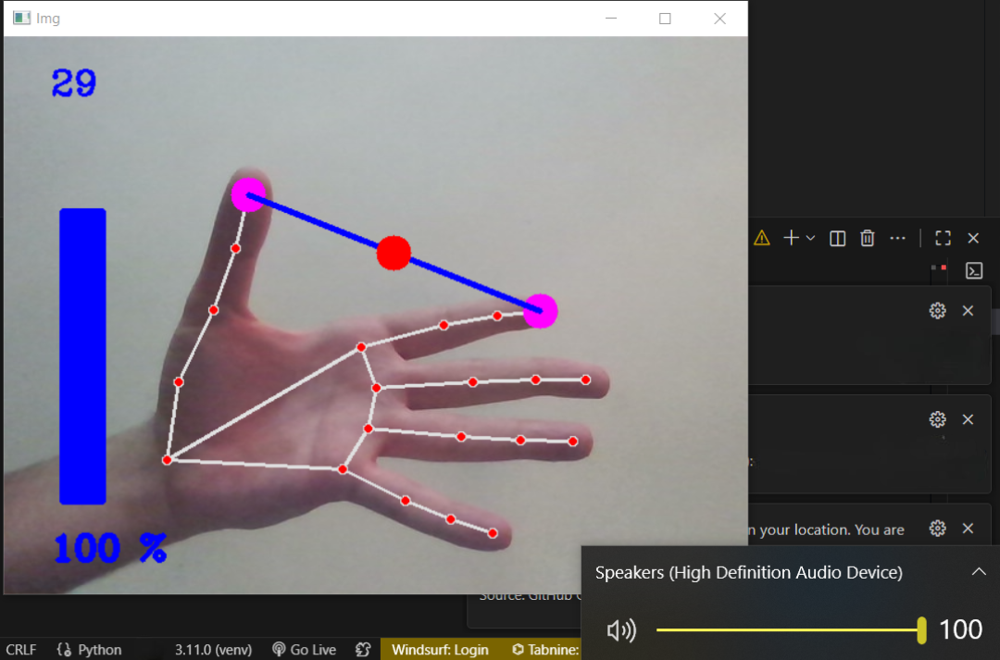

# Hand Gesture Volume Control

This project allows you to control your system's master volume using hand gestures. By adjusting the distance between your thumb and index finger in front of a webcam, you can seamlessly increase or decrease the volume.




---

## Features

- **Real-time Gesture Recognition:** Uses the MediaPipe library for fast and accurate hand tracking.
- **Intuitive Volume Control:** The distance between the thumb and index finger directly maps to the system volume level.
- **Visual Feedback:** An on-screen volume bar and percentage display provide immediate visual feedback.
- **Cross-Platform:** Works on Windows (thanks to `pycaw`).

---

## Requirements

- OpenCV
- MediaPipe
- NumPy
- pycaw

This project also uses the `HandTrackingModule` from my other repository for hand detection. The module is included in this repository for convenience. You can check out the original module here:

- **[Hand-Detection-OpenCV-MediaPipe](https://github.com/nimabgr/Hand-Detection-OpenCV-MediaPipe)**
---

## How to Use

1.  **Clone the repository:**
    ```bash
    git clone https://github.com/nimabgr/Hand-Gesture-Volume-Control.git
    cd Hand-Gesture-Volume-Control
    ```

2.  **Install the required libraries:**
    ```bash
    pip install -r requirements.txt
    ```

3.  **Run the script:**
    ```bash
    python VolumehandControl.py
    ```

4.  **Control the Volume:**
    - Show your hand to the webcam.
    - Change the distance between your thumb tip (landmark 4) and index fingertip (landmark 8) to control the volume.
    - Press 'q' to quit the application.

---

## How It Works

The script captures video from the webcam and uses the `HandTrackingModule` to detect hand landmarks. It then calculates the Euclidean distance between the tips of the thumb and the index finger. This distance is mapped to the system's volume range (e.g., 0% to 100%). Finally, it uses the `pycaw` library to set the master volume accordingly.
